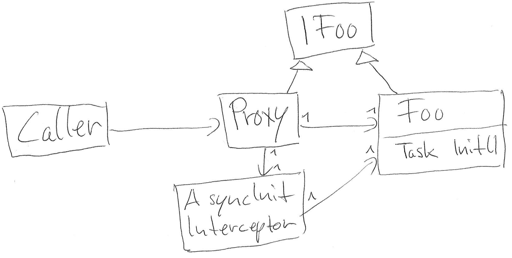

# NinjectAsyncInitializationByInterception
## Code relating to [Stackoverflow Answer regarding ´async´ initialization](http://stackoverflow.com/a/19138759/684096)

As per your request i'm posting a solution which employs ninject. I diverted slightly from your goals as the constructor is not performing the initialization but a method is. The method is called by the interceptor. Async-Ctor is most likely possible by changing to an "interface proxy without target" (see http://docs.castleproject.org/Tools.Kinds-of-proxy-objects.ashx) and having the interceptor instanciate the object.

I also want to say that i believe async-initialization probably will provide more downsides than benefits. For example, it will be difficult to handle initialization exceptions, since any call on the interface may result in an initialization exception.

IFoo is bound to InterceptingProxyProvider : IProvider. The provider instanciates Foo, all interceptors for Foo, and then creates and returns a castle dynamic proxy (Proxy). This is what Caller receives when IFoo is being injected. The AsyncInitializationInterceptor starts initialization of Foo in it's constructor. Upon the first intercepted call, it waits for initialization to complete, then proceeds. In case initialization fails with an exception, all further access to IFoo will result in the initialization exception being thrown.

On a further note, the ninject proxy extension creates an interceptor instance per target type. However, what we want is one interceptor instance per target instance. This is why i provided a custom implementation of binding & instanciation of the proxy & interceptors.